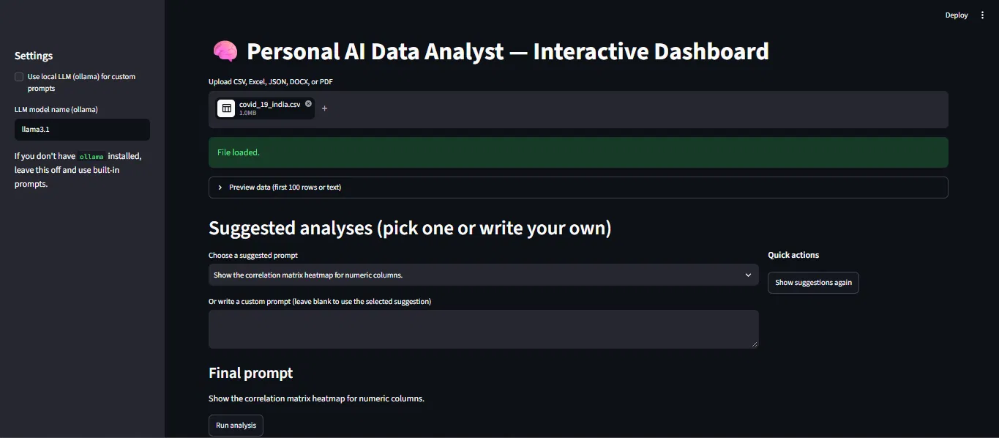
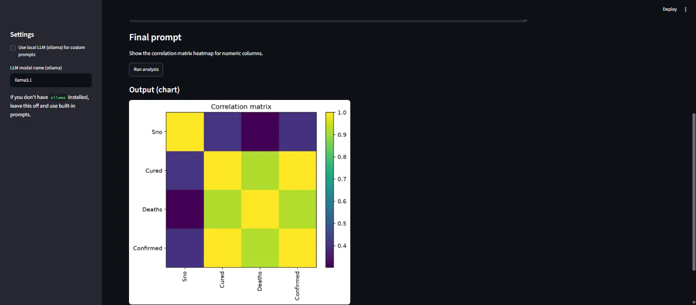

# AI Data Analyst

A Streamlit app that loads a dataset and runs quick exploratory analysis from suggested prompts. Optionally, a local LLM (Ollama) can turn custom prompts into Python code.

## What it does
- Loads **CSV, Excel, JSON, DOCX and PDF** files (DOCX/PDF are read as text).
- Detects numeric, categorical and datetime columns and generates up to **8 suggested analyses** automatically.
- Runs the suggestions without any LLM, using built-in Pandas/Matplotlib code:
  - dataset summary (rows, columns, missing values)
  - top value counts for a categorical column
  - summary statistics for numeric columns
  - histogram of a numeric column
  - scatter plot of two numeric columns
  - top 10 rows sorted by a numeric column
  - monthly time series (when a datetime column exists)
  - correlation matrix heatmap
  - z-score anomaly check (shown when fewer than 8 suggestions are generated)
- **Optional:** with [Ollama](https://ollama.com) installed locally, custom prompts are converted to Python code by a local model (default `llama3.1`).

## Tech stack
Python, Pandas, NumPy, Matplotlib, Streamlit, python-docx, pypdf, openpyxl.

## Run locally
```bash
pip install -r requirements.txt
streamlit run app.py
```
Upload a file, pick a suggested analysis (or type a custom prompt), and click **Run analysis**.

For the optional LLM mode, install Ollama, run `ollama pull llama3.1`, and tick the checkbox in the sidebar.

## Project structure
```
app.py            # Streamlit interface
try1.py           # data loading, type detection, prompt-to-code, code runner, Ollama call
requirements.txt
```

## Limitations
- Generated analysis code is executed with `exec()`. Use it **locally with files you trust**; it is not hardened for public deployment.
- Built-in prompts cover the analyses listed above; anything else needs the optional Ollama mode.
- LLM output quality depends on the local model you choose.
- No automated tests yet.

## License
MIT. See [LICENSE](LICENSE).

   
   
